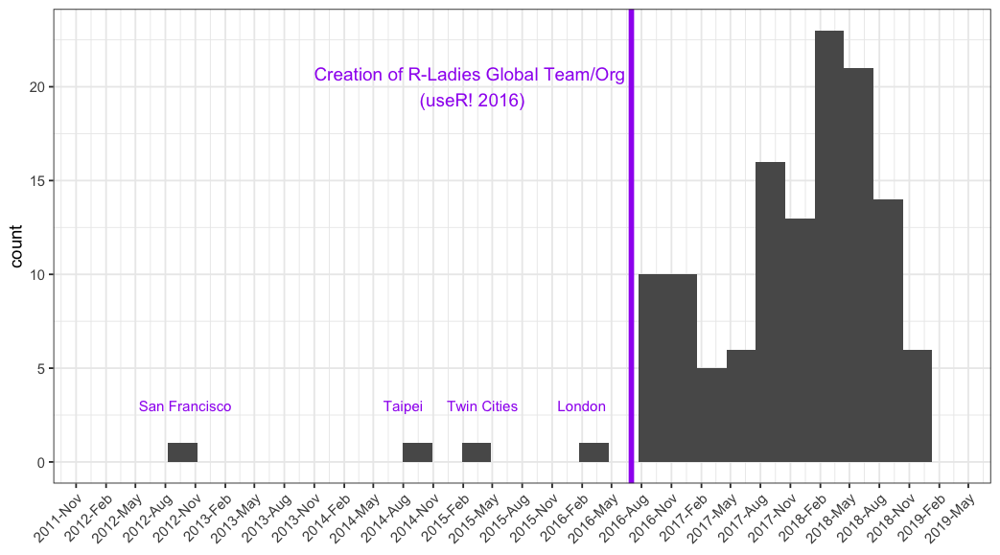
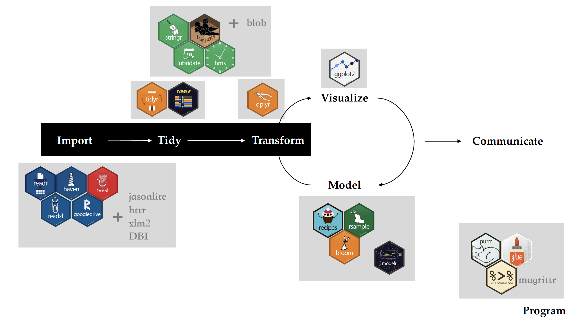
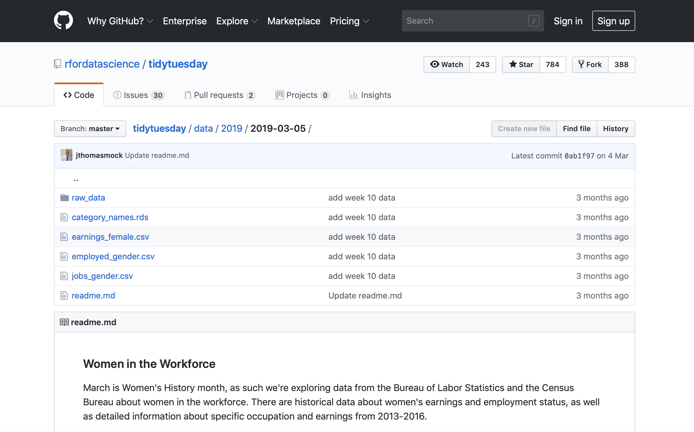

```{r setup, include=FALSE}
options(htmltools.dir.version = FALSE)
```
# Agenda

### 1. Get to know each other
### 2. What is R-Ladies?
### 3. Introduction to the Tidyverse

---
class: inverse, center, middle

```{r clock, echo = FALSE}
countdown::countdown(minutes = 5, 
                     seconds = 0,
                     top = 0,
                     left = 0,
                     right = 0,
                     play_sound = TRUE,
                     color_border = "#FFFFFF",
                     color_background = "#88398A",
                     color_text = "#FFFFFF",
                     color_running_background = "#FFFFFF",
                     color_running_border = "#88398A",
                     color_running_text = "#88398A",
                     color_finished_text = "#FFFFFF")

countdown::countdown(minutes = 1,
                     seconds = 0,
                     play_sound = TRUE,
                     right = "33%")

```

# Get to know each other

Who am I? 

Where am I from?

What do I do?

Experience with R 

Hobbies/Funny thing

---
class: inverse, center, middle

# What is R-Ladies?

---
# R-Ladies

.pull-left[

</div> 
]

.pull-right[
###**Worldwide** organization that promotes 

- ###**gender diversity** in the R-community 

- ###via **meetups** and **mentorship** 

- ###in a **friendly** and **safe** environment
]

---
# R-Ladies

- R-Ladies is a user-run group, meaning it is all of us that keep it going.

- Everyone is welcome to present something, no matter their skill level. 

- Presentations may be to showcase something you've been working on, to get feed-back on your approach or code, or just because you want to contribute and practise giving talks about coding.

- Everyone has something new to learn, and even a novice may have found an interesting way of doing someting an expert didn't think of.

---
# Code of Conduct

- Public events are **always** for free

- The conceptual domain / scope is **R**-specifc

- Be aware and acknowledge **other**'s contribution

- Use neutral language

- Constructive, supportive and **gender-inclusive** environment to share, learn and network

- Mentoring and organization is exclusively reservaded for women

---

# R-Ladies History

<div style= "float:left; position: absolute;  padding: 10px;">
.pull-left[

]
</div>

.pull-right[
###1st of October 2012
**Gabriela de Queiroz** founded R-Ladies 

She wanted to give back to the community after going to several meetups and learning a lot for free. 

The first meetup took place in San Francisco, California (United States). 
]

---
# R-Ladies Growth
<div style="vertical-align: middle;display: inline-block; width:750px;">



---
# R-Ladies Global

```{r mapGlobal, out.width = '100%', fig.height = 6, eval = require('leaflet'), echo = FALSE}

library(leaflet)

load(here::here("data", "dataRladiesGlobalMap.RData"))

rladiesCitiesLocations %>%
  leaflet() %>%
  addTiles() %>%
  addCircleMarkers(lng = ~lng, lat = ~lat, label = ~City,
                   color = "#88398A", fillColor = "#562457")
```

---
class: inverse, center, middle

# R-Ladies in Germany

---
# R-Ladies in Germany

```{r mapGermany, out.width = '100%', fig.height = 6, eval = require('leaflet'), echo = FALSE}

library(leaflet)

load(here::here("data", "dataRladiesGermanyMap.RData"))

locationGermany %>%
  leaflet() %>%
  setView(lng = 10.018343, lat = 51.133481, zoom = 5) %>%
  addTiles() %>%
  addCircleMarkers(lng = ~lng, lat = ~lat, label = ~City,
                   color = "#88398A", fillColor = "#562457")
```

---
class: inverse, center, middle

# R-Ladies Frankfurt

---
# Goals R-Ladies Frankfurt


Build an **active**, **supportive**, and **empowering** R community of women to:

- Learn R

- Teach R

- Share experiences

- Improve together

- Network

### More women coding, developing and creating R packages and being involved in the R community

---
# To keep in mind...

We all have different knowledge and level of experience `r emo::ji("geek")`
<br>
--
<br>
No matter if we're newbie or proficient R user, there's always something that we don't know! `r emo::ji("search")`
<br>
--
<br>
No matter if you're newbie or proficient R user, don't be shy to ask, comment! `r emo::ji("raised")`
<br>
--
<br>
We're here to learn together! `r emo::ji("biceps")`

.pull-right[

]

---
# How to be engaged?

.center[
### Participate in meetup

### Give a tutorial

### Mentor

### ...
]

---
class: inverse, center, middle

# Introduction to the Tidyverse

---
class: center, middle

# What are your expectations?

---
# Objectives

1. To generally understand tidyverse and differences between tidyverse and base R

2. To recognize packages and functions to wrangle data in the tidyverse

4. To write code using tidyverse packages

---
class: center, middle

# Tidyverse

---
# The tidyverse

.pull-left[
```{r tidyverse, fig.align = "center", out.width = "70%", echo = FALSE}

knitr::include_graphics(
  "https://github.com/rstudio/hex-stickers/raw/master/SVG/tidyverse.svg?sanitize=true")

```
]

.pull-right[
.center[

"(...) **collection of R** `r emo::ji("package")` designed for data science. All packages **share** an underlying **design philosophy**, **grammar**, and **data structures**." ([www.tidyverse.org](https://www.tidyverse.org/))

Packages built on and in base R

]
<br>
Tidyverse:
- [style](https://style.tidyverse.org) guide
- [design principles](https://principles.tidyverse.org)
]

---
# Principles in the tidyverse

1. Consistent data structures: **data frame**. Usually, tidy data format:
  - Each variable must have its own column
  - Each observation must have its own row
  - Each value must have its own cell

2. Each function should solve one small and well-defined class of problems

3. Rely on function composition to simplify data science workflow by using, as an example, the `magrittr` **pipe** thus enhancing readability and avoiding the need to name interim objects

### `r emo::ji("warning")` Note:
Tidyverse is a quite handy set of tools for solving data science problems and recommended to work with data up to 1-2 Gb. When you work with larger data (10-100 Gb), you should use `data.table` as well as other approaches to the data (Grolemund & Wickham, 2017).

---
background-image: url(https://raw.githubusercontent.com/tidyverse/tidyverse/master/man/figures/logo.png)
background-size: 100px
background-position: 90% 3%

# Install [tidyverse](www.tidyverse.org) `r emo::ji("package")`

.pull-left[
```{r installTidyverse, eval = FALSE}
# Install all tidyverse packages
install.packages("tidyverse")
```
]

.pull-right[
```{r installAll, eval = FALSE}
# Equivalent of
install.packages("ggplot2")
install.packages("dplyr")
install.packages("tidyr")
install.packages("readr")
install.packages("purrr")
install.packages("tibble")
install.packages("hms")
install.packages("stringr")
install.packages("lubridate")
install.packages("forcats")
install.packages("DBI")
install.packages("haven")
install.packages("httr")
install.packages("jsonlite")
install.packages("readxl")
install.packages("rvest")
install.packages("xml2")
install.packages("modelr")
install.packages("broom")
```
]

.footnote[
<hr>
source: [Github tidyverse](https://github.com/tidyverse/tidyverse) on 22 May 2019
]

---
# Data science project with tidyverse

.center[
"The tidyverse is a **language** for solving **data science** challenges with **R code**." 
<br>
(Hadley Wickham)
]



---
background-image: url(https://raw.githubusercontent.com/tidyverse/tidyverse/master/man/figures/logo.png)
background-size: 100px
background-position: 90% 3%

# Load [tidyverse](www.tidyverse.org) `r emo::ji("package")`

```{r loadTidyverse}
# Load core packages
library(tidyverse)
```

---
class: center, middle

# Data

---
# Datasets

**Source:**
<br>
Github of [TidyTuesday: A weekly data project in R from the R4DS online learning community](https://github.com/rfordatascience/tidytuesday)

**Datasets #10: 2019-03-05**
<br>
Data [Women in the Workforce](https://github.com/rfordatascience/tidytuesday/tree/master/data/2019/2019-03-05)

.pull-left[

]

.pull-right[
.center[
**Question?**

`r emo::ji("question")` Between 2013 and 2016, were the earnings of women and men similar across occupations for full-time workers? 
]
]

The data format is **csv**

---
class: center, middle

# Import data

---
background-image: url(https://github.com/rstudio/hex-stickers/raw/master/SVG/readr.svg?sanitize=true)
background-size: 100px
background-position: 90% 3%

# Import data with [readr](http://readr.tidyverse.org/)

- Loads flat files in R
- Imports rectangular data frames (columns are variables and rows are observations)
- `readr::read_csv()` is faster than `read.csv()`


--
```{r importDataJobs, message = FALSE, warning = FALSE, paged.print = FALSE, cache = TRUE, eval = FALSE}
# Import data from github
jobsGender <- read_csv("https://raw.githubusercontent.com/rfordatascience/tidytuesday/master/data/2019/2019-03-05/jobs_gender.csv")

employedGender <- read_csv("https://raw.githubusercontent.com/rfordatascience/tidytuesday/master/data/2019/2019-03-05/employed_gender.csv")

```

---
background-image: url(https://github.com/rstudio/hex-stickers/raw/master/SVG/readr.svg?sanitize=true)
background-size: 100px
background-position: 90% 3%

# Import data with readr

```{r printData, message = FALSE, warning = FALSE, paged.print = FALSE, cache = TRUE, eval = TRUE, highlight.output = c(14, 15)}
# Import data from github
jobsGender <- read_csv("https://raw.githubusercontent.com/rfordatascience/tidytuesday/master/data/2019/2019-03-05/jobs_gender.csv")

# Print data
jobsGender

```

---
background-image: url(https://github.com/rstudio/hex-stickers/raw/master/SVG/readr.svg?sanitize=true)
background-size: 100px
background-position: 90% 3%

# Write to a file with readr

```{r saveData, eval = FALSE}

# Save data locally
write_csv(jobsGender, path = "./data/jobsGender.csv")
write_csv(employedGender, path = "./data/employedGender.csv")
```

---
class: center, middle

# Tidy data

---
background-image: url(https://github.com/rstudio/hex-stickers/raw/master/SVG/tidyr.svg?sanitize=true)
background-size: 100px
background-position: 90% 3%

# Reshape data with [tidyr](http://tidyr.tidyverse.org/)

- Creates a tidy dataset by reshaping the layout of tabular data
- Usually solves the following **problems**:
  * One variable spread across multiple columns
  * One observation scattered across multiple rows

- Important **verbs**:

  * `gather()` - gathers multiple columns into a new one, result "wide" cata becomes longer
  * `spread()` - spreads rows into multiple columns, result "long" data becomes wider
  
  * `separate()` - separates a column into multiple columns
  * `unite()` - unites multiple columns into one

---
background-image: url(https://github.com/rstudio/hex-stickers/raw/master/SVG/tidyr.svg?sanitize=true)
background-size: 100px
background-position: 90% 3%

# Reshape data with tidyr

```{r tidyData, eval = FALSE}

# Gather columns into two new columns
jobsTidy <- gather(jobsGender, 
                   key = "workerGender", 
                   value = "earnings",
                   c(workers_male, workers_female))

dplyr::glimpse(jobsTidy)

# Inspect values of variable workerGender
unique(jobsTidy$workerGender)

```
--
<br>
```{r tidyDataSep, eval = FALSE}

# Separate column workerGender into three new columns
jobsTidySep <- separate(jobsTidy, 
                        col = workerGender,
                        into = c("totalEarnings", "earningsTotal", "gender"),
                        sep = "_",
                        remove = TRUE)

dplyr::glimpse(jobsTidySep)

```

---
class: center, middle

# It's your turn...

Do other variables in this dataset require such procedure?
<br>
Or other `tidyr` verb?

---
class: center, middle

# Transform data

---
background-image: url(https://github.com/rstudio/hex-stickers/raw/master/SVG/dplyr.svg?sanitize=true)
background-size: 100px
background-position: 90% 3%

# Manipulate data with [dplyr](http://dplyr.tidyverse.org/)

- Grammar of data manipulation
- Transforms tabular data

- Basic single-table **verbs** for data manipulation:
  * `mutate()` - creats new variables that are functions of existing variables
  * `select()` - extracts variables
  * `filter()` - extract rows that meet logical criteria
  * `summarise()` / `summarize()` - calculate aggregate measures for groups
  * `arrange()` - reorder the rows
  * `group_by()` - group by one or more variables
  
- Some two-table **verbs** for data manipulation:
  * `inner_join()`
  * `left_join()`
  * `right_join()`
  * `full_join()`
  * `semi-join()`
  * `anti_join()`

---
background-image: url(https://github.com/rstudio/hex-stickers/raw/master/SVG/dplyr.svg?sanitize=true)
background-size: 100px
background-position: 90% 3%

# Manipulate data with dplyr

```{r join, eval = FALSE}

# Join two datasets
joinJobs <- inner_join(jobsTidySep, 
                       employedGender,
                       by = "year")

dplyr::glimpse(joinJobs)

```
--
<br>
```{r select, eval = FALSE}

# Select variables of interest
joinJobsShort <- select(joinJobs, c(year:minor_category, earnings, gender, full_time_female, full_time_male))


dplyr::glimpse(joinJobsShort)

```

---
background-image: url(https://github.com/rstudio/hex-stickers/raw/master/SVG/dplyr.svg?sanitize=true)
background-size: 100px
background-position: 90% 3%

# Manipulate data with dplyr

```{r filter, eval = FALSE}

# Filter women
jobsFilter <- filter(joinJobsShort, gender == "female")

```
--
<br>
.pull-left[
**Logical operators**
  * `==`  equal
  * `>`   greater than
  * `<`   less than
  * `>=`  greater than or equal
  * `<=`  less yhan or equal
  * `!=`  not equal
]

.pull-right[
**Boolean operators**
  * `&` and
  * `|` or
  * `!` not
]
---
background-image: url(https://github.com/rstudio/hex-stickers/raw/master/SVG/dplyr.svg?sanitize=true)
background-size: 100px
background-position: 90% 3%

# Manipulate data with dplyr

```{r summarise, eval = FALSE}

# Summarise
summarise(jobsFilter, earnMean = mean(earnings, na.rm = TRUE))

```
--
<br>
**Summary functions**
  * `min()`
  * `max()`
  * `mean()`
  * `median()`
  * `quantile()`
  * `sd()`
  * `var()`
  * `IQR()`
  
---
background-image: url(https://github.com/rstudio/hex-stickers/raw/master/SVG/pipe.svg?sanitize=true)
background-size: 100px
background-position: 90% 3%

# The pipe operator: %>%

- `magrittr` package
- loads automatically
- code more readable when successive commands are required
<br>
<br>

.center[
<br>
<br>
`function(object, arguments)`

with pipe

`object %>% function(arguments)`

pipe can be read as **"then"**
]

---
background-image: url(https://github.com/rstudio/hex-stickers/raw/master/SVG/pipe.svg?sanitize=true)
background-size: 100px
background-position: 90% 3%

# Piped code

```{r pipe, eval = FALSE}

# Code with pipe
pipeSummary <- joinJobs %>%
  select(c(year:minor_category, earnings, gender, full_time_female, full_time_male)) %>% 
  filter(gender == "female") %>% 
  group_by(occupation, major_category, minor_category) %>% 
  summarise(earningsMean = mean(earnings, na.rm = TRUE)) %>%
  arrange(desc(earningsMean))

```

---
class: inverse, center, middle

# Bring it all together

---
# It's your turn...

```{r clockCode, echo = FALSE}
countdown::countdown(minutes = 15, 
                     seconds = 00,
                     color_border = "#88398A",
                     color_running_background = "#88398A",
                     color_running_text = "#FFFFFF",
                     color_finished_text = "#FFFFFF")
```

<br>
<br>
<br>

.center[
**Question?**

`r emo::ji("question")` Between 2013 and 2016, were the earnings of women and men similar across occupations for full-time workers? 
]

---
# Additional Resources

### Books and Papers
- Grolemund, G., & Wickham, H. (2017). [*R for Data Science.*](https://r4ds.had.co.nz)
- Grolemund, G. (2019). [*The Tidyverse Cookbook.*](https://rstudio-education.github.io/tidyverse-cookbook/)
- Ross, Z., Wickham, H., & Robinson, D. (2017). [Declutter your R workflow with tidy tools.](https://peerj.com/preprints/3180/) *PeerJ Preprints*.
- Wickham, H. (2014). [Tidy data](https://www.jstatsoft.org/article/view/v059i10). *Journal of Statistical Software*, *59*(10), 1-23.

### Other
- RStudio [cheat sheets](https://www.rstudio.com/resources/cheatsheets/)
- [tidyverse](https://www.tidyverse.org/) website

---
class: inverse, center, middle

# Save the date!

### 19th June
18:00-21:00

### Data visualization with R

`r emo::ji("location")` Frankfurt School of Finance and Management

---

class: center, middle

# Keep in touch!
<br>

`r icon::fa(name = "envelope", color = "#88398A")` [frankfurt@rladies.org](mailto:frankfurt@rladies.org) <br>
`r icon::fa_meetup(color = "#88398A")` [https://www.meetup.com/rladies-frankfurt/](https://www.meetup.com/rladies-frankfurt/) <br>
`r icon::fa_twitter(color = "#88398A")` [@RLadiesFRA](https://twitter.com/RLadiesFRA) <br>
<br>
<br>
<br>
<br>

Slides created via the R package [**xaringan**](https://github.com/yihui/xaringan) by [Yihui Xie](https://twitter.com/xieyihui?lang=en) with the [Rladies](https://alison.rbind.io/post/r-ladies-slides/) theme by [Alison Hill](https://twitter.com/apreshill).

---
class: inverse, center, middle

# Thank you!


